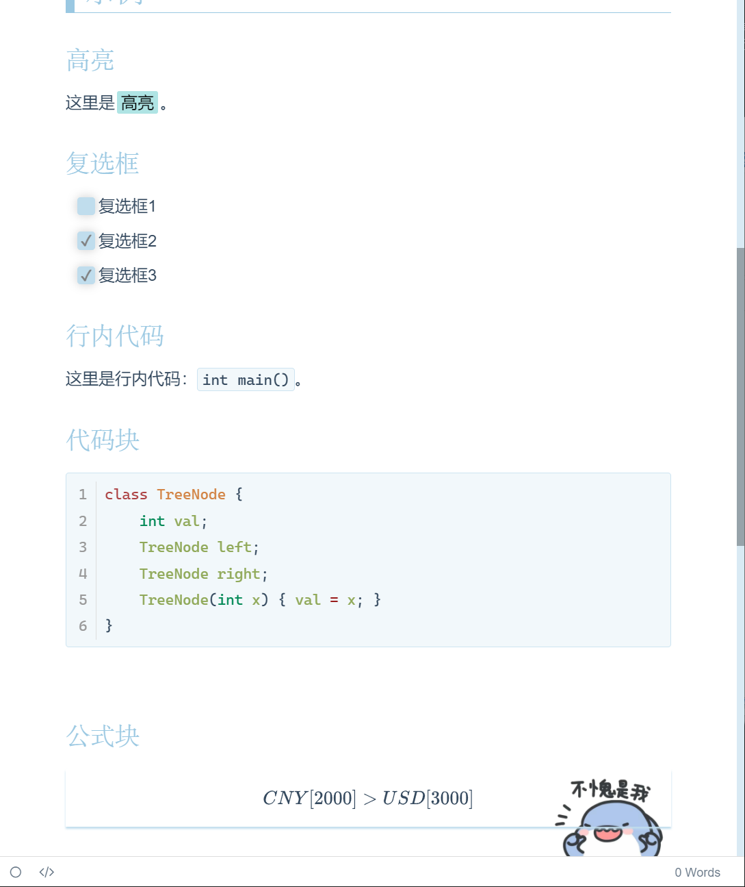
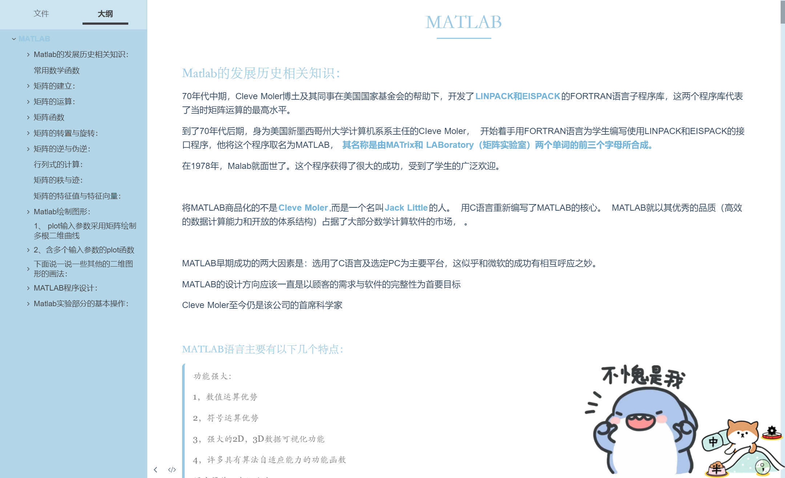
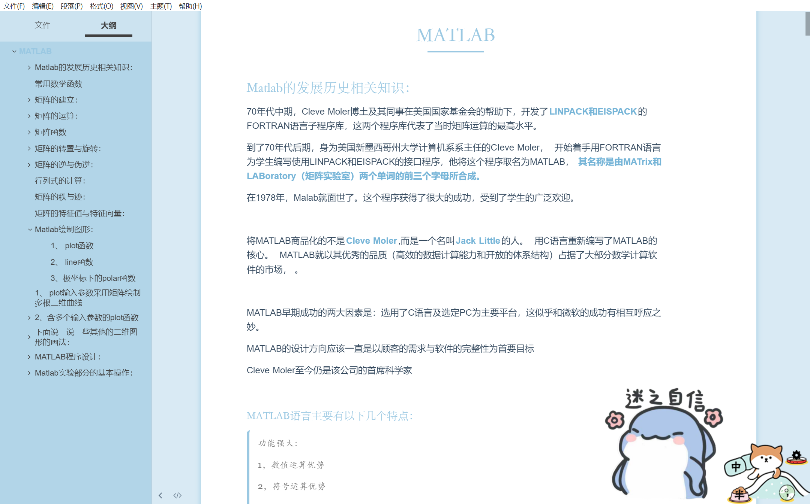

# 小鲨鱼主题

## 说明

- 都说用 typora 做笔记，写东西比较方便，这半年用下来确实是如此，比 word 文档在某些方面确实是要方便的不少，然后如果你有一个漂亮的主题，确实是可以促进我们的学习积极性的；

- 然后我对这个小鲨鱼的表情包情有独钟，然后将网上的一些案例稍作修改，得到了小鲨鱼的主题，自己用着感觉还不错，写这篇文章将主题分享给大家一起使用；
- 最后说明一点，本人在制作这个小鲨鱼主题的时候并没有系统学习过前端的知识，所以可能会存在些许bug，最后感谢网上的大佬们的优秀模板供我修改；

主题使用字体：

```
思源宋体
思源黑体
Fira Code
```

## 示例

详情可见`example.md`。








## 使用方法

1. 在GitHub下载此主题。
2. 打开Typora主题文件夹，并将下载的`shayu.css`和`shayu-card.css`两个文件以及`shayu`文件夹复制进去，右下角的小鲨鱼图片可在`shayu`文件夹中自行替换，我们提供了三种选择，当然如果你有更好的图片也是可以替换的，啰嗦一句，图片最好是矢量图。
3. 重启Typora将主题换成`shayu`或`shayu-card`即可。


## 提示

1. 提供两种样式的主题：
   * 平铺式（例图1）：`shayu`
   * 卡片式（例图2）：`shayu-card`
2. 右下角的鲨鱼图片，可在`shayu`文件夹中自行替换。
3. 可在`标准化颜色替换表.txt`中将5种标准化颜色复制至`.css`文件开头对应位置并覆盖，即可更换主题颜色，图片也可以自行替换，只是需要在 css 文件中写对正确的background文件的相对路径，同时.css文件名也可自行修改。
4. 当然如果你想要更多的颜色也是可以的，你需要将你喜欢的颜色转化成十六进制的HEX值，然后在开头处进行替换即可


